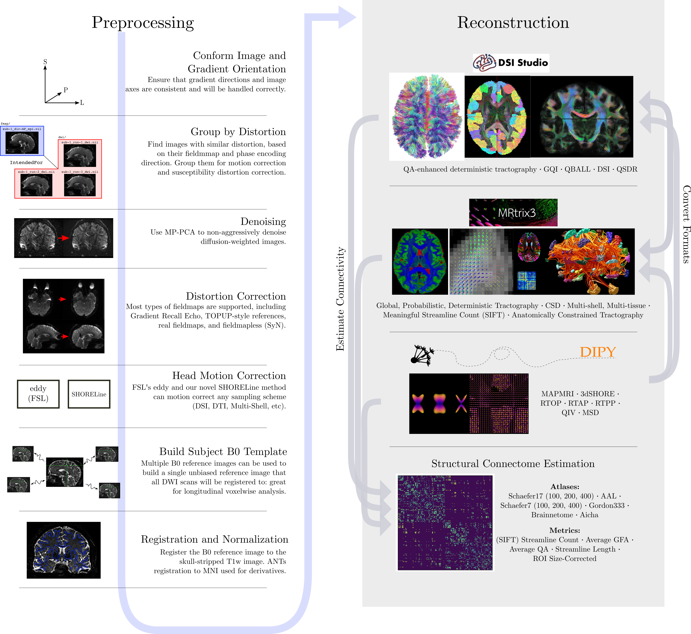

.. include:: ../links.rst

.. _methods:

#################
Methods reference
#################

These pages describe what each part of the pipeline does, in what order, and
which options change it. They stay at the level needed to choose options and
read the reports and the methods boilerplate. The reasoning behind each
correction, and the artifacts they address, will be covered in
|artifacts_book|.

   The preprocessing pipeline. Anatomical processing and DWI processing run
   in parallel until coregistration.

*QSIPrep* builds one workflow per subject (or per session, with
``--subject-anatomical-reference sessionwise``). It contains one anatomical
workflow and one DWI workflow per :ref:`output <grouping>`. The DWI workflow
runs the stages below and, at the end, resamples the corrected data into
``ACPC`` space and writes the derivatives.

.. list-table::
   :header-rows: 1
   :widths: 30 45 25

   * - Stage
     - What happens
     - Page
   * - Anatomical processing
     - Conform, brain extract, segment, AC-PC align and normalize the
       anatomical reference
     - :doc:`anatomical`
   * - Per-series preprocessing
     - Denoise and unring each series; concatenate; gradient nonlinearity
       field
     - :doc:`preprocessing`
   * - Head motion and eddy currents
     - One of three backends
     - :doc:`hmc_eddy`, :doc:`hmc_tortoise`, :doc:`hmc_shoreline`
   * - Susceptibility distortion
     - Estimated from a fieldmap, reverse phase encoding, or an anatomical
       reference; applied inside the head motion backend or after it
     - :doc:`sdc`
   * - Coregistration and resampling
     - DWI reference, registration to the anatomical, one resampling into
       ``ACPC`` space, bias correction, merging
     - :doc:`resampling`

The DWI workflow for one output, with no fieldmap:

.. workflow::
    :graph2use: orig
    :simple_form: yes

    from qsiprep_docs import example_unit, AP, ANATOMICAL_TEMPLATE
    from qsiprep.workflows.dwi.base import init_dwi_preproc_wf

    wf = init_dwi_preproc_wf(
        example_unit('single'),
        t2w_sdc=False,
        output_prefix='',
        source_file=AP,
        anatomical_template=ANATOMICAL_TEMPLATE,
    )

The node names in these graphs are the ones that appear in the log
(see :ref:`reading_the_log`).

.. toctree::
   :maxdepth: 1

   anatomical
   preprocessing
   hmc_eddy
   hmc_tortoise
   hmc_shoreline
   sdc
   resampling
