.. include:: ../links.rst

.. _sdc_methods:

####################################
Susceptibility distortion correction
####################################

:func:`qsiprep.workflows.fieldmap.base.init_sdc_wf`

Echo-planar images are stretched and compressed along the phase encoding
axis where the magnetic field is inhomogeneous. Correcting this needs an
estimate of the field, which can come from a fieldmap, from images acquired
with opposite phase encoding, or from registration to an undistorted
anatomical image. *QSIPrep* decides which one a series gets from the
metadata (see :ref:`linking_fieldmaps`), prefers reverse phase encoding over
a GRE fieldmap when both are linked, and uses an anatomical reference only
as a fallback unless ``--force sdc-anat-reference`` is given. The tool that
applies the estimate depends on the head motion backend:

.. list-table::
   :header-rows: 1
   :widths: 28 24 24 24

   * - Estimated from
     - ``eddy``
     - ``tortoise``
     - ``shoreline``
   * - Reverse phase-encoded b=0 or DWI series
     - TOPUP, inside ``eddy``; optionally refined by DRBUDDI
     - DRBUDDI
     - DRBUDDI
   * - GRE fieldmap
     - Inside ``eddy``
     - Applied after DIFFPREP
     - Applied after SHORELine
   * - Synthetic b=0 (``synb0``)
     - TOPUP, inside ``eddy``
     - T2Wreg
     - Not available
   * - T2w (``t2w``)
     - Not available
     - T2Wreg
     - Not available
   * - Inverted T1w (``invt1w``)
     - SyN
     - SyN
     - SyN

The correction that ran is named in the visual report, in the methods
boilerplate, and in the ``EstimationMethod`` of the displacement map
derivative (see :ref:`outputs`).

.. _sdc_topup:

*****
TOPUP
*****

TOPUP :footcite:p:`topup` estimates the field from b=0 images acquired with
different phase encoding directions or readout times. From each distortion
group of the correction unit, *QSIPrep* selects b=0 images, preferring those
native to the series being corrected over borrowed ones, and passes them to
TOPUP. The field is applied by ``eddy`` inside its own resampling, so it
never exists as a standalone correction; for the displacement map
derivative it is rebuilt from TOPUP's field in Hz. TOPUP is only available
with ``--hmc-method eddy``.

.. _drbuddi_tool:

*******
DRBUDDI
*******

:func:`qsiprep.workflows.fieldmap.drbuddi.init_drbuddi_wf`

DRBUDDI :footcite:p:`drbuddi`, from TORTOISE, estimates the field by
registering the two phase encoding directions to each other after head
motion correction. With reverse phase-encoded DWI *series* it uses the b=0
image and the fractional anisotropy image of each direction together, in a
multi-modal registration; with a lone reverse b=0 (an ``epi`` fieldmap) it
registers the b=0 images. A T2w image is added to the registration when one
is available and ``t2w`` is not ignored; it is first rotated into the b=0
frame by an ``antsAI`` rotation search (see :ref:`b0_reg`), because
DRBUDDI's own rigid initialization cannot recover large rotations. Intensities are then adjusted with
TORTOISE's least-squares restoration (see :ref:`jacobian_methods`).

DRBUDDI runs after ``eddy``, DIFFPREP or SHORELine, and processes exactly one
matched pair of phase encoding directions per invocation. On the ``eddy``
backend it can either replace TOPUP (``--sdc-method drbuddi``) or refine it
(``--sdc-method topup+drbuddi``), in which case the refinement is written as
a separate ``desc-sdcrefinement`` displacement map.

.. workflow::
    :graph2use: orig
    :simple_form: yes

    from qsiprep_docs import example_unit
    from qsiprep.workflows.fieldmap.drbuddi import init_drbuddi_wf

    wf = init_drbuddi_wf(example_unit('pepolar'), t2w_sdc=False)

.. _sdc_gre:

*************
GRE fieldmaps
*************

:func:`qsiprep.workflows.fieldmap.phdiff.init_phdiff_wf`,
:func:`qsiprep.workflows.fieldmap.fmap.init_fmap_wf`

A phase-difference or two-phase fieldmap is unwrapped with ROMEO
:footcite:p:`romeo` as implemented in niimath :footcite:p:`niimath`, and
converted to a field in Hz :footcite:p:`jezzard1995`; a Hz fieldmap is
masked and median-filtered. The magnitude image is registered to the b=0
reference, and the field is turned into a displacement along the phase
encoding axis using the series' ``TotalReadoutTime`` and applied with ANTs.
Since 26.1 none of this needs FSL, so GRE fieldmaps work in the FSL-free
image as well.

With ``--hmc-method eddy``, the field is handed to ``eddy`` and applied
inside its model. With the other backends it is applied to the
motion-corrected series at the final resampling, and an unwarped b=0
reference is computed for coregistration.

.. workflow::
    :graph2use: orig
    :simple_form: yes

    from qsiprep_docs import example_unit
    from qsiprep.workflows.fieldmap.base import init_sdc_wf

    wf = init_sdc_wf(example_unit('phasediff'))

.. _sdc_gre_init:

Initializing DRBUDDI and T2Wreg from a GRE fieldmap
===================================================

Registration-based correction infers the field by matching images, which is
ambiguous where the field piles several voxels' signal into one or drops it
out. A GRE fieldmap measures the field directly. So when a series is
corrected by DRBUDDI or T2Wreg and a GRE fieldmap also lists it, the
GRE-derived warp is the registration's starting point: for DRBUDDI, the
initial transform of the primary direction and, negated, of the reverse
direction; for T2Wreg, the initial transform. The initial warp is held fixed
through the registration's multi-resolution pyramid, so each stage estimates
a residual correction on top of it rather than smoothing it away.

This happens whenever the linkage is present, on every backend that runs
DRBUDDI (except when DRBUDDI only refines TOPUP) and on T2Wreg when the
anatomical reference is forced. How to set up the sidecars is in
:ref:`gre_init_flags`. The report's distortion correction entry ends in
``(GRE-initialized)`` and the boilerplate describes the initialization.

.. _sdc_synb0:

*****
SynB0
*****

:func:`qsiprep.workflows.fieldmap.synb0.init_synb0_wf`

With ``--sdc-anat-reference synb0``, a synthetic distortion-free b=0 image is
generated from the T1w and the distorted b=0 with the SynB0-DISCO U-Net
:footcite:p:`synb0disco`. The synthetic image then stands in for a reverse
phase-encoded acquisition: with ``eddy`` it joins the TOPUP inputs as a
volume with zero readout time, and with DIFFPREP it is the T2Wreg target.
The report shows the acquired and synthetic b=0 side by side. Requires a
T1w and a ``PhaseEncodingDirection`` on the DWI series.

.. _sdc_t2wreg:

******
T2Wreg
******

TORTOISE's T2Wreg (``--epi T2Wreg`` in DIFFPREP) nonlinearly registers the
b=0 to the subject's T2w image, or to the synthetic b=0 above, in the same
run as head motion correction. The T2w is rotated into the b=0 frame by an
``antsAI`` rotation search first, for the same reason as with DRBUDDI. It is only available with
``--hmc-method tortoise``. Its correction is applied without Jacobian
modulation, as in TORTOISE; ``--force jacobian`` modulates it anyway.

.. _sdc_syn:

***
SyN
***

:func:`qsiprep.workflows.fieldmap.syn.init_syn_sdc_wf`

With ``--sdc-anat-reference invt1w``, the fieldmap-less method from
fMRIPrep :footcite:p:`fieldmapless1,fieldmapless2` registers the b=0 to
the T1w with its intensity inverted, with the deformation constrained to the
phase encoding axis and regularized by an average fieldmap template
:footcite:p:`fieldmapless3`. It runs after any head motion backend and is
never selected by ``auto``.

.. _jacobian_methods:

********************
Intensity modulation
********************

Correcting a spatial distortion moves signal between voxels, so the
corrected image has to be rescaled by the local volume change, or regions
the acquisition compressed stay too bright :footcite:p:`rohde2004`.
*QSIPrep* follows TORTOISE's two implementations. **Jacobian**: each volume
is multiplied by the derivative of the composed displacement along the phase
encoding axis, used when only one phase encoding polarity was acquired (GRE
and SyN fieldmaps, and single-polarity DIFFPREP runs). **LSR**: when both
polarities exist, DRBUDDI computes the harmonic mean of the two corrected
b=0 images and each direction's volumes are scaled by the ratio of that
reference to their own corrected b=0; this replaces the Jacobian entirely.
Head motion, coregistration and normalization are never modulated: a rigid
realignment is not a volume change, and modulating by a normalization warp
would corrupt the signal.

============================== ==========================================
Correction                     Modulated by
============================== ==========================================
Gradient nonlinearity          *QSIPrep* (Jacobian; not under LSR)
Susceptibility (TOPUP)         ``eddy``, internally
Susceptibility (DRBUDDI)       *QSIPrep* (LSR)
Susceptibility (GRE)           ``eddy`` on its path, else *QSIPrep*
Susceptibility (SyN)           *QSIPrep* (Jacobian)
Susceptibility (T2Wreg)        none, unless ``--force jacobian``
Eddy current (``eddy``)        ``eddy``, internally
Eddy current (DIFFPREP)        *QSIPrep* (Jacobian; not under LSR)
============================== ==========================================

``--ignore jacobian`` disables only the modulation *QSIPrep* itself applies.
``eddy`` modulates whenever its resampling method is ``jac`` (the default);
with ``"method": "lsr"`` in ``--eddy-config`` it does not modulate at all,
and *QSIPrep* cannot retrofit that. The run then warns, and the gap is
recorded in the ``UnmodulatedCorrections`` key of the Jacobian derivative's
sidecar. The weights *QSIPrep* applied are written as the ``desc-jacobian``
derivative described in :ref:`outputs`.

**********
References
**********

.. footbibliography::
