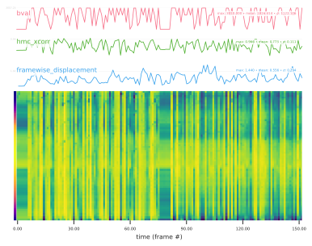
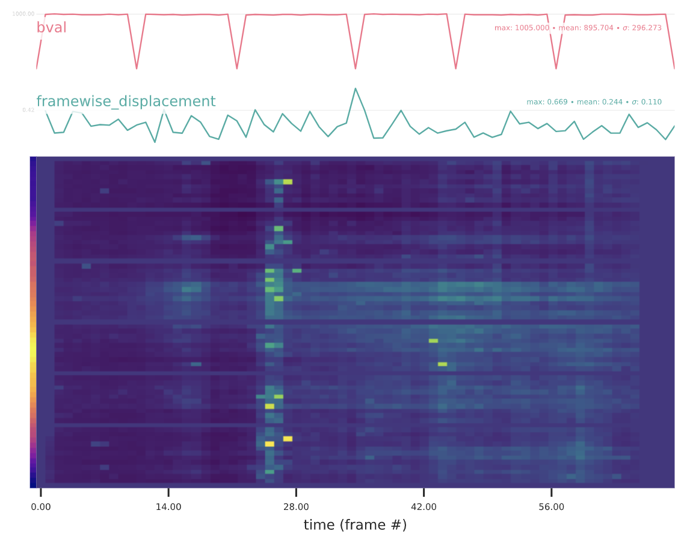

.. include:: links.rst

.. _outputs:

#######
Outputs
#######

*QSIPrep* writes four kinds of output to ``<output_dir>``:

1. **Visual reports**, one HTML file per subject (or per session), with a
   figure for each step of the pipeline.
2. **Preprocessed data**: the corrected, resampled DWI series with their
   gradient tables, brain masks, and the anatomical derivatives.
3. **Data for later steps**: the transforms between spaces, confounds, and
   the fieldmap and modulation maps that were applied.
4. **Quality control tables**: one row per output image summarizing head
   motion and image quality.

Files follow the `BIDS Derivatives`_ naming rules. Volumetric outputs are in
``ACPC`` space (see :ref:`output_resolution`) and carry ``space-ACPC`` in
their names.

*****************
Layout and naming
*****************

::

  <output_dir>/
    dataset_description.json
    sub-<label>.html                      # or sub-<label>_ses-<label>.html
    sub-<label>/
      [ses-<label>/]
        anat/
        dwi/
        figures/                          # the report's figures
        log/<run uuid>/                   # qsiprep.toml, CITATION.md, ...

The DWI output basename comes from the grouping (see :ref:`grouping`). By
default the series of a session form one output, whose name keeps the
entities the series share and drops the ones that differ; ``run-01`` and
``run-02`` of ``acq-multishell`` become ``sub-1_ses-1_acq-multishell``. With
``--separate-all-dwis`` each output keeps its input's name. The ``desc``
entity in a source name is not carried over.

.. _visual_reports:

**************
Visual reports
**************

One report is written per subject, or per session with
``--subject-anatomical-reference sessionwise``. ``--report-output-level``
moves them into the subject or session directories.

The report opens with how *QSIPrep* grouped the subject's scans: which
scans estimate each fieldmap, which fieldmap corrects which scan, and what
ends up in each output, with every inferred decision marked as inferred. This
is the same view `qsiplan`_ prints before a run. The anatomical section shows
the conformed input, brain extraction, segmentation and template
normalization. Each DWI output then has a section with the denoising and
unringing residuals, the distortion correction before and after and the
field that was applied, the b=0 reference and its AC-PC reorientation, the
coregistration to the anatomical, the bias field correction, the q-space
sampling scheme before and after correction, and the carpet plot described
below. A
methods section at the end contains the boilerplate text for the run.

Check the sampling scheme viewer in particular. It shows the q-space
samples as acquired and after preprocessing, with the b-vectors rotated by
the head motion correction, and confirms that the rotation did not disrupt
the scheme. The one below is from a multi-shell acquisition; drag to rotate
it and scroll to zoom.

.. raw:: html
    :file: _static/sampling_scheme.html

Carpet plots
============

The fMRI carpet plot of the time series does not make sense for DWI data.
Instead the report plots, for each raw slice, how well the head motion
model's prediction agrees with that slice.

    For DIFFPREP and SHORELine, the cross-correlation between each slice and
    the model-predicted signal: higher scores are yellow, lower scores blue.
    The bar on the left shows how many brain voxels each slice contains, and
    the traces above give the whole-brain fit and framewise displacement per
    volume.

    For ``eddy``, the number of outlier slices: more outliers are yellow,
    fewer are blue.

****************
Preprocessed DWI
****************

Per output, in ``dwi/``::

  # The preprocessed DWI series, its gradient tables, and its brain mask
  <source_entities>_space-ACPC_desc-preproc_dwi.nii.gz
  <source_entities>_space-ACPC_desc-preproc_dwi.json
  <source_entities>_space-ACPC_desc-preproc_dwi.bval       # FSL format
  <source_entities>_space-ACPC_desc-preproc_dwi.bvec
  <source_entities>_space-ACPC_desc-preproc_dwi.b          # MRtrix3 format
  <source_entities>_space-ACPC_desc-preproc_dwi.b_table.txt  # DSI Studio format
  <source_entities>_space-ACPC_desc-brain_mask.nii.gz

  # The b=0 reference of the preprocessed series
  <source_entities>_space-ACPC_desc-preproc_dwiref.nii.gz

  # Per-volume confounds and QC (below)
  <source_entities>_desc-confounds_timeseries.tsv
  <source_entities>_space-ACPC_desc-image_qc.tsv
  <source_entities>_space-ACPC_desc-slice_qc.json

  # Contrast-to-noise ratio of the head motion model, per shell
  <source_entities>_space-ACPC_model-<label>_stat-cnr_dwimap.nii.gz

The ``.bval``/``.bvec`` pair is read correctly by FSL, DSI Studio and DIPY
but not by MRtrix3, which mis-reads FSL-style vectors; use the ``.b`` file
there (``mrconvert -grad *_dwi.b``). The brain mask is generous on purpose.

The sidecar ``desc-preproc_dwi.json`` records how the output was made: the
source series and their grouping, the fieldmap and method that corrected
each, the head motion method, and the keys described in the sections below.

Fieldmap and modulation maps
============================

Present when the corresponding correction ran::

  # The susceptibility distortion correction, as a displacement map
  <source_entities>_space-ACPC_desc-sdc_displacement.nii.gz
  <source_entities>_space-ACPC_desc-sdc_displacement.json
  # TOPUP followed by DRBUDDI only: DRBUDDI's refinement of the TOPUP field
  <source_entities>_space-ACPC_desc-sdcrefinement_displacement.nii.gz

  # The Jacobian weights QSIPrep applied (see below)
  <source_entities>_space-ACPC_desc-jacobian_dwimap.nii.gz
  <source_entities>_space-ACPC_desc-jacobian_dwimap.json

  # The voxelwise gradient deviation, with --gradient-file
  <source_entities>_space-ACPC_graddev.nii.gz
  <source_entities>_space-ACPC_graddev.json

The displacement map shows the susceptibility correction on the output grid
so it can be inspected and compared across methods and runs. At each voxel
of the corrected image the vector points to where that tissue was in the
distorted data, in ITK (LPS+) mm coordinates, in the layout 3D Slicer and
ITK-SNAP display. It describes the first DWI series of the output; a reverse
phase-encoded partner is distorted the other way. The sidecar's
``EstimationMethod`` names the tool and ``TransformFile`` the transforms that
carried the correction into ``ACPC`` space. It is written only when
distortion correction ran and the output was not assembled by
``--distortion-group-merge``.

.. warning::
    The displacement maps are for inspection only. They are not valid
    transforms and must not be used for resampling.

The Jacobian map holds the intensity modulation *QSIPrep* itself applied,
which is not all of it: ``eddy`` modulates its own corrections internally
and leaves no map. The sidecar gives ``SignalRedistributionMethod``
(``Jacobian`` or ``LSR``), ``JacobianWeightIndex`` (which volume of the map
applies to each DWI volume; the file is 3D when every volume shares one
map), ``AppliedCorrections`` and ``UnmodulatedCorrections``. Dividing the
preprocessed series by the indexed weight reverses the multiplication at the
point where it was applied, not the whole preprocessing, because bias
correction runs after it. See :ref:`jacobian_methods` for which component
modulates what.

The gradient deviation map holds, as nine volumes in row-major order, the
3x3 matrix ``L`` such that the gradient actually applied at a voxel is
``L @ g`` for the nominal vector ``g``. It changes both direction and
b-value, and downstream tools that accept a gradient deviation file (for
example DSI Studio) can use it directly. Its orientation into ``ACPC`` space
comes from a rigid registration TORTOISE estimates itself, recorded in the
sidecar as ``GradientDeviationOrientation``, which is close to but not the
same as the coregistration *QSIPrep* applied to the data. It is not written
for outputs assembled by ``--distortion-group-merge``.

**********************
Anatomical derivatives
**********************

In ``anat/``, nearly the same files as fMRIPrep writes, except that they are
in LPS+ orientation and AC-PC aligned::

  <source_entities>_space-ACPC_desc-preproc_T1w.nii.gz    # N4-corrected reference
  <source_entities>_space-ACPC_desc-brain_mask.nii.gz     # SynthStrip
  <source_entities>_space-ACPC_dseg.nii.gz                # SynthSeg tissue classes
  <source_entities>_space-ACPC_desc-aseg_dseg.nii.gz      # SynthSeg regions
  <source_entities>_space-ACPC_desc-unfatsat_T2w.nii.gz   # when a T2w is present

With ``--anat-modality T2w`` the reference is ``desc-preproc_T2w``. The same
files are written in ``space-MNI152NLin2009cAsym`` unless
``--skip-anat-based-spatial-normalization`` is given.

.. _transforms:

**********
Transforms
**********

Anatomical, in ``anat/``::

  sub-<label>_from-anat_to-ACPC_mode-image_xfm.mat
  sub-<label>_from-ACPC_to-anat_mode-image_xfm.mat
  sub-<label>_from-ACPC_to-MNI152NLin2009cAsym_mode-image_xfm.h5
  sub-<label>_from-MNI152NLin2009cAsym_to-ACPC_mode-image_xfm.h5
  sub-<label>[_ses-<label>]_from-orig_to-anat_mode-image_xfm.txt   # per input image

DWI, in ``dwi/``. The coregistration target is named after
``--dwiref-definition``, following fMRIPrep 26.0's convention: the level is
the ``space`` of the reference image, and ``desc-coreg`` marks the
transforms. With ``distortion-group`` (the default) each group's reference
is registered to the anatomical directly::

  <source_entities>_space-distortiongroup_dwiref.nii.gz
  <source_entities>_from-distortiongroup_to-ACPC_mode-image_desc-coreg_xfm.mat
  <source_entities>_from-ACPC_to-distortiongroup_mode-image_desc-coreg_xfm.mat

With ``subject``, one mid-point reference is built from every group's
reference and registered once::

  sub-<label>_space-subject_dwiref.nii.gz
  sub-<label>_space-ACPC_desc-subject_dwiref.nii.gz
  sub-<label>_from-subject_to-ACPC_mode-image_desc-coreg_xfm.mat
  sub-<label>_from-ACPC_to-subject_mode-image_desc-coreg_xfm.mat
  sub-<label>_desc-templateQC_dwiref.tsv

The per-group ``from-distortiongroup_to-subject`` transform is written only
when ``--dwiref-construction-transform`` is ``Rigid`` or ``Affine``. The
nonlinear template builds produce an affine and a warp per group, which do
not fit a single-file transform, so with the default ``BSplineSyN`` no
transform out of ``space-distortiongroup`` is written.

Head motion, eddy-current and susceptibility corrections are applied by
``eddy`` and DIFFPREP inside their own resampling and do not come out as
reusable transforms, so *QSIPrep* does not write them.

.. _dwi_confounds:

*********
Confounds
*********

``<source_entities>_desc-confounds_timeseries.tsv`` has one row per volume of
the output::

  framewise_displacement	trans_x	trans_y	trans_z	rot_x	rot_y	rot_z	hmc_r2	hmc_xcorr	original_file	grad_x	grad_y	grad_z	bval

  n/a    -0.705	-0.002	0.133	0.119	0.350	0.711	0.941	0.943	sub-abcd_dwi.nii.gz	0.000	0.000	0.000	0.000
  16.343	-0.711	-0.075	0.220	0.067	0.405	0.495	0.945	0.946	sub-abcd_dwi.nii.gz	0.000	0.000	0.000	0.000
  35.173	-0.672	-0.415	0.725	0.004	0.468	1.055	0.756	0.766	sub-abcd_dwi.nii.gz	-0.356	0.656	0.665	3000.000

The motion parameters are the head motion method's estimates in RAS+
(translations in mm, rotations in radians), and framewise displacement is
computed from them. ``hmc_r2`` and ``hmc_xcorr`` are the whole-brain fit between
the model-predicted target and the corrected volume, from the model-based
methods (SHORELine and DIFFPREP). ``eddy``
and DIFFPREP add their per-volume eddy-current field coefficients as
``eddy_ec_*`` and ``diffprep_ec_*`` columns. The last columns are
bookkeeping: which input file, gradient direction and b-value each volume
came from, which helps track down corrupted volumes or a motion model that
fails on particular gradient strengths. The accompanying JSON sidecar
describes each column.

.. _qc_data:

********************
Quality control data
********************

``<source_entities>_space-ACPC_desc-image_qc.tsv`` has one row per output
image and is meant for comparing subjects before deciding whom to include in
a group analysis. Columns prefixed ``raw_`` are DSI Studio's quality
measures :footcite:p:`yeh2019` computed on the data before preprocessing,
and ``t1_`` columns the same measures on the preprocessed data. Motion
summaries follow: ``mean_fd`` and ``max_fd``, ``max_translation`` and
``max_rotation``, and their frame-to-frame maxima ``max_rel_translation``
and ``max_rel_rotation``. ``t1_dice_distance`` is the Dice distance between
the DWI brain mask and the anatomical brain mask.

.. _boilerplate:

********************
Citation boilerplate
********************

Every run writes ``log/<run uuid>/CITATION.md`` (with ``.html`` and ``.tex``
versions) describing the methods used, with citations for every tool. It is
also shown at the end of the visual report. ``--boilerplate-only`` writes it
without running anything, which is useful for checking what a set of
options will do.

**********
References
**********

.. footbibliography::
