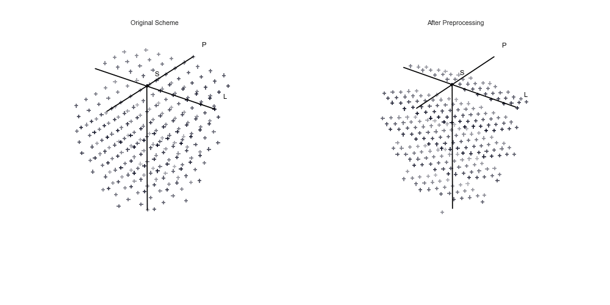
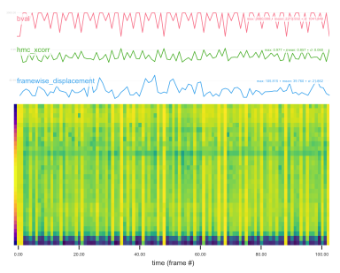
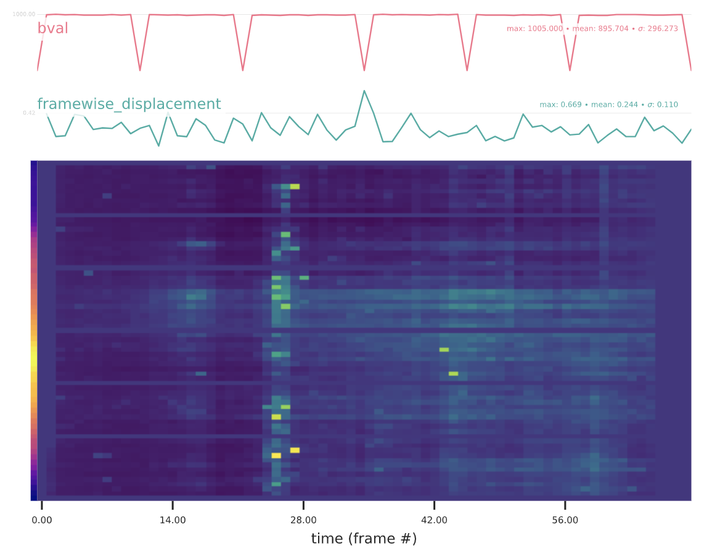
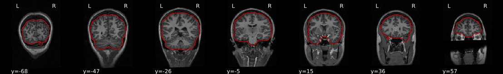

.. include:: links.rst

.. _preprocessing:

Preprocessing
=============

Building a pipeline
--------------------

QSIPrep builds a pipeline based on your BIDS inputs. In general the pipeline will incorporate
all the data it knows how to handle (i.e. fieldmaps, dMRI and anatomical data) automatically.
There may be cases where you want to change the default behavior, particularly in regard to

  1. :ref:`merging`
  2. :ref:`merge_denoise`
  3. Head motion correction, either

    a. :ref:`fsl_wf`
    b. :ref:`dwi_hmc`

  4. :ref:`dwi_only`

.. _merging:

Merging multiple scans from a session
^^^^^^^^^^^^^^^^^^^^^^^^^^^^^^^^^^^^^^^

For q-space imaging sequences it is common to have multiple separate scans to
acquire the entire sampling scheme. These scans get aligned and merged into
a single DWI series before reconstruction. It is also common to collect
a DWI scan (or scans) in the reverse phase encoding direction to use for
susceptibility distortion correction (SDC).

This creates a number of possible scenarios for preprocessing your DWIs. These
scenarios can be controlled by the ``--separate-all-dwis`` argument. If your study
has multiple sessions, DWI scans will *never* be combined across sessions.
Merging only occurs within a session.

If ``--separate-all-dwis`` is present in the commandline call, each dwi
scan in the ``dwi`` directories will be processed independently. You will have one
preprocessed output per each DWI file in your input.

Otherwise (default) the DWI scans will be merged (i.e. their images will be concatenated).
The merging affects the pipeline at different stages.  If all DWIs in a session
are in the same PE direction, they will be merged into a single series. If there are
two PE directions detected in the DWI scans and ``'fieldmaps'`` is not in ``ignore``,
images are combined according to their PE direction, and their b0 reference images are used to
perform SDC. Further complicating this is the FSL workflow, which combines distortion correction
with eddy/motion correction and will merge scans with different PE directions.

If you have some scans you want to combine and others you want to preprocess separately,
you can call qsiprep more than once with BIDS filters to process the different scans.

.. _bids_filters:

Using BIDS filters
^^^^^^^^^^^^^^^^^^^

BIDS filters allow users to filter the set of images available to QSIPrep at run
time. BIDS filters should be stored in a json file and passed to QSIPrep with
the ``--bids-filter-file`` option.
Filters modify "queries", which are used to find data for each data type.
NOTE: this is illustrating how modalities are queried in general, and is not the format
of the file you will send to ``--bids-filter-file``. The queries in QSIPrep are::

  {
      "fmap": {"datatype": "fmap"},
      "sbref": {"datatype": "func", "suffix": "sbref"},
      "flair": {"datatype": "anat", "suffix": "FLAIR"},
      "t2w": {"datatype": "anat", "suffix": "T2w"},
      "t1w": {"datatype": "anat", "suffix": "T1w"},
      "roi": {"datatype": "anat", "suffix": "roi"},
      "dwi": {"datatype": "dwi", "suffix": "dwi"}
  }

Each query has several "entities", which can be modified by filters. The list of
supported entities is `here
<https://github.com/bids-standard/pybids/blob/master/bids/layout/config/bids.json>`__.
To filter data, modify the queries by changing one or more of the supported
entities in the BIDS filter file. The general format of the filter file is::

  {
    "query": { "entity": "value" }
  }

The entities specified in the filter file are added to the queries, so you only
need to include entities you want to use for filtering. For example, this could
be the contents of a valid BIDS filter file::

  {
      "t1w": { "session": "MR1" },
      "dwi": { "session": "MR1", "run": "1" }
  }

this modifies the "t1w" and "dwi" queries, and filters both T1w and DWI scans to
select session "MR1". It also filters on the run number for DWI scans only.

Multiple runs can be selected by passing arrays. For example::

  {
      "dwi": { "run": [2,3] }
  }

filters the "dwi" query for runs 2 and 3.

You can enable regular expressions for more detailed filtering, for example::

  {
      "t1w": { "acquisition": "(?i)mprage", "regex_search": "true" },
  }

will do a case-insensitive match of "mprage" within the "t1w" query.

.. _merge_denoise:

Denoising and Merging Images
^^^^^^^^^^^^^^^^^^^^^^^^^^^^

The user can decide whether to do certain preprocessing steps and, if so,
whether they are performed *before* or *after* the DWI series are
concatenated. Specifically, image denoising (using ``dwidenoise`` or
``patch2self``) can be disabled with ``--denoise-method none``. Gibbs
unringing (using ``mrdegibbs``) is disabled by default but can be enabled
with ``--unringing-method mrdegibbs``. B1 bias field correction is applied by
default (using ``dwibiascorrect``) and can be disabled with the
``--dwi-no-biascorr`` option. The intensity of b=0 images is harmonized
across scans (i.e. scaled to an average value) by default, but this can be
turned off using ``--dwi-no-b0-harmonization``.

Together, denoising (MP-PCA or patch2self), Gibbs unringing B1 bias field
correction and b=0 intensity normalization are referred to as *denoising* in
QSIPrep. Each of these image processing operations has assumptions about its
inputs and changes the distribution of noise in its outputs. Although the
inclusion of each operation can be decided by the user, the order in which
they are applied relative to one another is fixed. MP-PCA or patch2self are
applied directly to the BIDS inputs, which should be uninterpolated and as
"raw" as possible. Although Gibbs unringing should be performed on "raw"
data, it is recommended in the MRtrix3 documentation to apply MP-PCA before
Gibbs unringing. B1 bias field correction and b=0 intensity harmonization
do not have as specific requirements about their inputs so are run last.

The last, and potentially very important decision, is whether the denoising
operations are applied to each input DWI series individually or whether the
denoising operations are applied to the concatenated input DWI files. At
present, there is little data to guide this choice. The more volumes
available, the more data MP-PCA/patch2self have to work with. However, if
there if the head is in a vastly different location in different scans,
denoising might be impacted in unpredictable ways.

Consider MP-PCA. If a voxel contains CSF in one DWI series and the subject
repositions their head between scans so that the voxel contains corpus
callosum in the next DWI series, the non-noise signal will be very different
in the two series. Similarly, if the head is repositioned different areas
will be closer to the head coil and therefore be inconsistently affected by
B1 bias field. Similar problems can also occur *within* a DWI series due to
subject head motion, but these methods have been shown to work well even in
the presence of within-scan head movement. If the head position changes
across scans is of a similar magnitude to that of within-scan head motion, it
is likely fine to use the ``--denoise-after-combining`` option. To gauge how
much between-scan motion occurred, users can inspect the :ref:`qc_data` to see
whether Framewise Displacement is large where a new series begins.

By default, the scans in the same warped space are individually denoised before
they are concatenated. When warped groups are concatenated an additional b=0
image intensity normalization is performed.

Preprocessing HCP-style
^^^^^^^^^^^^^^^^^^^^^^^

QSIPrep can be configured to produce a very similar pipeline to the HCP dMRI pipelines.
HCP and HCP-Lifespan scans acquire complete multi-shell sequences in opposing phase
encoding directions, making them a special case where :ref:`sdc_pepolar` are used
and the corrected images from both PE directions are averaged at the end. To produce
output from ``qsiprep`` that is directly comparable to the HCP dMRI pipeline you
will want to include::

  --distortion-group-merge average \
  --combine-all-dwis \

If you want to disable the image pair averaging and get a result with twice as
many images, you can substitute ``average`` with ``concat``.

.. _outputs:

Outputs of qsiprep
-------------------

qsiprep generates three broad classes of outcomes:

  1. **Visual QA (quality assessment) reports**:
     one :abbr:`HTML (hypertext markup language)` per subject,
     depicting images that provide a sanity check for each step of the pipeline.

  2. **Pre-processed imaging data** such as anatomical segmentations, realigned and resampled
     diffusion weighted images and the corresponding corrected gradient files in FSL and MRTrix
     format.

  3. **Additional data for subsequent analysis**, for instance the transformations
     between different spaces or the estimated head motion and model fit quality calculated
     during model-based head motion correction.

  4. **Quantitative QA**:
     A single-line csv file per subject summarizing subject motion, coregistration quality and
     image quality.

Visual Reports
^^^^^^^^^^^^^^^

qsiprep outputs summary reports, written to ``<output_dir>/qsiprep/sub-<subject_label>.html``.
These reports provide a quick way to make visual inspection of the results easy.
One useful graphic is the animation of the q-space sampling scheme before and after the pipeline.
Here is a sampling scheme from a DSI scan:

    A Q5 DSI sampling scheme before (left) and after (right) preprocessing.
    This is useful to confirm that the gradients have indeed been rotated and
    that head motion correction has not disrupted the scheme extensively.

Preprocessed data (qsiprep *derivatives*)
^^^^^^^^^^^^^^^^^^^^^^^^^^^^^^^^^^^^^^^^^^^

There are additional files, called "Derivatives",
written to ``<output_dir>/qsiprep/sub-<subject_label>/``.

Derivatives related to anatomical files are nearly identical to those produced by ``fMRIprep`` and
can be found in the ``anat`` subfolder.
One major difference is that the anatomical derivatives are in LPS+ orientation and are realigned to the AC-PC,
while ``fMRIprep``'s are in RAS+ orientation and retain the original anatomical images' orientation ::

  sub-<label>/[ses-<label>/]
    anat/
      # Brain mask derived from SynthStrip
      <source_entities>_space-ACPC_desc-brain_mask.nii.gz

      # Tissue-probability maps
      <source_entities>_space-ACPC_label-CSF_probseg.nii.gz
      <source_entities>_space-ACPC_label-GM_probseg.nii.gz
      <source_entities>_space-ACPC_label-WM_probseg.nii.gz

      # Tissue class map derived SynthSeg
      <source_entities>_space-ACPC_dseg.nii.gz

      # Bias field corrected T1w file, using ANTS' N4BiasFieldCorrection
      <source_entities>_space-ACPC_desc-preproc_T1w.nii.gz

      # The same files as above, but in the selected output space.
      <source_entities>_space-MNI152NLin2009cAsym_desc-brain_mask.nii.gz
      <source_entities>_space-MNI152NLin2009cAsym_label-CSF_probseg.nii.gz
      <source_entities>_space-MNI152NLin2009cAsym_label-GM_probseg.nii.gz
      <source_entities>_space-MNI152NLin2009cAsym_label-WM_probseg.nii.gz
      <source_entities>_space-MNI152NLin2009cAsym_dseg.nii.gz
      <source_entities>_space-MNI152NLin2009cAsym_desc-preproc_T1w.nii.gz

Derivatives related to diffusion images are in the ``dwi`` subfolder ::

  sub-<label>/[ses-<label>/]
    dwi/
      # A tab-separated value file with one column per calculated confound
      # and one row per timepoint/volume
      <source_entities>_desc-confounds_timeseries.tsv

Volumetric outputs are written out in ``ACPC`` space ::

  sub-<label>/[ses-<label>/]
    dwi/
      <source_entities>_space-ACPC_dwiref.nii.gz

      # The generous brain mask that should be reduced probably
      <source_entities>_space-ACPC_desc-brain_mask.nii.gz
      <source_entities>_space-ACPC_desc-preproc_dwi.nii.gz

      # FSL-style bval and bvec files.
      # These will be incorrectly interpreted by MRTrix,
      # but will work with DSI Studio and Dipy.
      <source_entities>_space-ACPC_desc-preproc_dwi.bval
      <source_entities>_space-ACPC_desc-preproc_dwi.bvec

      # Use the ``.b`` file for MRTrix.
      # The gradient table to import data into MRTrix.
      # This can be used with the preprocessed DWI file and
      # converted directly to a ``.mif`` file using the
      # ``mrconvert -grad _dwi.b`` command.
      <source_entities>_space-ACPC_desc-preproc_dwi.b

      # Contrast-to-noise model defined as the variance of the
      # signal model divided by the variance of the error of the signal model.
      <source_entities>_space-ACPC_stat-cnr_desc-<label>_dwimap.json
      <source_entities>_space-ACPC_stat-cnr_desc-<label>_dwimap.nii.gz

Transforms
^^^^^^^^^^

QSIPrep will write out a series of transforms needed to map between the different spaces.

.. code-block::

  sub-<label>/
    anat/
      sub-<label>_from-anat_to-ACPC_mode-image_xfm.mat
      sub-<label>_from-ACPC_to-anat_mode-image_xfm.mat
      sub-<label>_from-ACPC_to-<output-space>_mode-image_xfm.h5
      sub-<label>_from-<output-space>_to-ACPC_mode-image_xfm.h5
    ses-<label>/
      anat/
        sub-<label>_ses-<label>_from-orig_to-anat_mode-image_xfm.txt
        sub-<label>_ses-<label>_from-anat_to-orig_mode-image_xfm.txt

.. important::

  Motion correction, eddy current correction, and distortion correction are performed with Eddy,
  which does not produce transforms that can be written out and reused.
  In the future, if Eddy starts writing out usable transforms
  or an alternate implementation is made available,
  QSIPrep may start writing these transforms out in a similar manner to fMRIPrep.

  These will most likely be organized thusly::

    sub-<label>/
      ses-<label>/
        dwi/
          sub-<label>_ses-<label>_from-orig_to-dwiref_mode-image_desc-eddy_xfm.h5

.. important::

  QSIPrep does not currently write out the coregistration transform from dwiref space to ACPC space.
  When it does start writing this transform out, it will be organized like this::

    sub-<label>/
      ses-<label>/
        dwi/
          sub-<label>_ses-<label>_from-dwiref_to-ACPC_mode-image_xfm.h5
          sub-<label>_ses-<label>_from-ACPC_to-dwiref_mode-image_xfm.h5

.. _dwi_confounds:

Confounds
^^^^^^^^^^^^

See implementation on :func:`~qsiprep.workflows.dwi.confounds.init_dwi_confs_wf`.

For each DWI processed by qsiprep, a
``<output_folder>/qsiprep/sub-<label>/func/<source_entities>_desc-confounds_timeseries.tsv``
file will be generated. These are :abbr:`TSV (tab-separated values)` tables,
which look like the example below::

  framewise_displacement	trans_x	trans_y	trans_z	rot_x	rot_y	rot_z	hmc_r2	hmc_xcorr	original_file	grad_x	grad_y	grad_z	bval

  n/a    -0.705	-0.002	0.133	0.119	0.350	0.711	0.941	0.943	sub-abcd_dwi.nii.gz	0.000	0.000	0.000	0.000
  16.343	-0.711	-0.075	0.220	0.067	0.405	0.495	0.945	0.946	sub-abcd_dwi.nii.gz	0.000	0.000	0.000	0.000
  35.173	-0.672	-0.415	0.725	0.004	0.468	1.055	0.756	0.766	sub-abcd_dwi.nii.gz	-0.356	0.656	0.665	3000.000
  45.131	0.021	-0.498	1.046	0.403	0.331	1.400	0.771	0.778	sub-abcd_dwi.nii.gz	-0.935	0.272	0.229	3000.000
  37.506	-0.184	0.117	0.723	0.305	0.138	0.964	0.895	0.896	sub-abcd_dwi.nii.gz	-0.187	-0.957	-0.223	2000.000
  16.388	-0.447	0.020	0.847	0.217	0.129	0.743	0.792	0.800	sub-abcd_dwi.nii.gz	-0.111	-0.119	0.987	3000.000

The motion parameters come from the model-based head motion estimation
workflow. The ``hmc_r2`` and ``hmc_xcorr`` are whole-brain r^2 values and
cross correlation scores (using the ANTs definition) between the
model-generated target image and the motion-corrected empirical image. The
final columns are not really confounds, but book-keeping information that
reminds us which 4d DWI series the image originally came from and what
gradient direction (``grad_x``, ``grad_y``, ``grad_z``) and gradient strength
``bval`` the image came from. This can be useful for tracking down
mostly-corrupted scans and can indicate if the head motion model isn't
working on specific gradient strengths or directions.

.. _qc_data:

Quality Control Data
^^^^^^^^^^^^^^^^^^^^

A single-line csv file (``desc-image_qc.csv``) is created for each output
image. This file is particularly useful for comparing the relative quality
across subjects before deciding who to include in a group analysis. The
columns in this file come from DSI Studio's QC calculation and is described
in [Yeh2019]_. Columns prefixed by ``raw_`` reflect QC measurements from the
data before preprocessing. Columns prefixed by ``t1_`` or ``mni_`` contain QC
metrics calculated on the preprocessed data. Motion parameter summaries are
also provided, such as the mean and max of framewise displacement
(``mean_fd``, ``max_fd``). The max and mean absolute values for translation
and rotation are ``max_translation`` and ``max_rotation`` and the maxima of
their derivatives are in ``max_rel_translation`` and ``max_rel_rotation``.
Finally, the difference in spatial overlap between the anatomical mask and
the anatomical brain mask and the DWI brain mask is calculated using the Dice
distance in ``t1_dice_distance`` and ``mni_dice_distance``.

Confounds and "carpet"-plot on the visual reports
^^^^^^^^^^^^^^^^^^^^^^^^^^^^^^^^^^^^^^^^^^^^^^^^^

fMRI has been using a "carpet" visualization of the
:abbr:`BOLD (blood-oxygen level-dependent)` time-series (see [Power2016]_),
but this type of plot does not make sense for DWI data. Instead, we plot
the cross-correlation value between each raw slice and the HMC model signal
resampled into that slice.
This plot is included for each run within the corresponding visual report.
Examples of these plots follow:

    For SHORELine higher scores appear more yellow, while lower scores
    are more blue. Not all slices contain the same number of voxels,
    so the number of voxels in the slice is represented in the color bar
    to the left of the image plot. The more yellow the pixel, the more
    voxels are present in the slice. Purple pixels reflect slices with fewer
    brain voxels.

    For eddy slices with more outliers appear more yellow, while fewer
    outliers is more blue.

.. _workflow_details:

Preprocessing pipeline details
------------------------------

``qsiprep`` adapts its pipeline depending on what data and metadata are
available and are used as the input.

Processing the *Subject Anatomical Reference* T1w or T2w images
^^^^^^^^^^^^^^^^^^^^^^^^^^^^^^^^^^^^^^^^^^^^^^^^^^^^^^^^^^^^^^^

:func:`qsiprep.workflows.anatomical.init_anat_preproc_wf`

.. workflow::
    :graph2use: orig
    :simple_form: yes

    from qsiprep.workflows.anatomical import init_anat_preproc_wf
    wf = init_anat_preproc_wf(omp_nthreads=1,
                              reportlets_dir='.',
                              output_dir='.',
                              dwi_only=False,
                              infant_mode=False,
                              template='MNI152NLin2009cAsym',
                              output_spaces=['T1w'],
                              output_resolution=1.25,
                              skull_strip_template='OASIS',
                              force_spatial_normalization=True,
                              freesurfer=True,
                              debug=False,
                              hires=True,
                              num_t1w=1)

As of version 0.18 QSIPrep has been changed to be very flexible with anatomical
processing workflows. Versions prior to 0.18 were focused on the T1w images and
provided only 2 possible templates. Version 0.18 introduces 2 terms that
simplify the anatomical processing and open up new opportunities for choosing
a template. First, is the *subject anatomical reference* and the second is the
*template anatomical reference*.

As a dMRI-focused tool, QSIPrep only uses an *anatomical reference* image for an
extra-robust brain extraction and to get a tissue segmentation for visualizing
the susceptibility distortion correction results.  The anatomical worflows
leverage fast and powerful tools from FreeSurfer, namely ``SynthStrip`` and
``SynthSeg`` to perform brain extraction and segmentation.

Many imaging protocols acquire some high-resolution, undistorted anatomical
reference scans. QSIPrep can use either T1-weighted ot T2-weighted 3D images as
the *anatomical reference*. To specify which contrast you'd like to use for your
anatomical reference, be sure to specify ``--anatomical-contrast`` as either
``T1w``, ``T2w`` or ``none``. Specifying ``none`` is equivalent to the previous
option of ``--dwi-only``, where no anatomical images are used from the input
data and the AC-PC alignment is based either on the adult or infant MNI
templates.

We discourage the use of ``--anatomical-contrast none`` in most cases. It is
very rare to have dMRI data without any kind of T1w or T2w image from the
same individual.

Regardless of whether you are using T1w or T2w images as your anatomical reference,
the following steps will be applied to the anatomical reference images:
Processing the *Anatomical Reference* images

  1. The anatomical sub-workflow begins by constructing an average image by
     :ref:`conforming <conformation>` all found T1w or T2w images to LPS+
     orientation and a common voxel size.
  2. If there are multiple images of the preferred anatomical contrast, they will
     be bias corrected using N4 and aligned to one another. If ``--subject-anatomical-reference unbiased``
     is specified they will be unbiasedly registered to each other using ANTs.
     Otherwise all the images are registered to the first (alphabetically) image (see
     `Longitudinal T1w processing`_).
  3. Brain extraction is performed using ``SynthStrip``.

    Brain extraction

  4. Brain tissue segmentation is performed using ``SynthStrip``

.. figure:: _static/segmentation.svg
    :scale: 100%

    Brain tissue segmentation.

  5. Rigid alignment to the *subject anatomical reference*. This can take
     two forms. If the *template anatomical reference* is a standard
     template, this will effectively AC-PC align the output data. If the
     *template anatomical reference* is another scan of the same
     individual (e.g. the output of fmriprep), the output will be aligned
     to this externam image.

  6. If the template anatomical reference is not a native scan, then ANTs'
     ``antsRegistration`` will register the subject images to the template
     anatomical reference in a multiscale, mutual-information based, nonlinear
     registration scheme.

.. _t1preproc_steps:

Handling Lesions and abnormalities
~~~~~~~~~~~~~~~~~~~~~~~~~~~~~~~~~~

When processing images from patients with focal brain lesions (e.g. stroke, tumor
resection), it is possible to provide a lesion mask to be used during spatial
normalization to MNI-space [Brett2001]_.
ANTs will use this mask to minimize warping of healthy tissue into damaged
areas (or vice-versa).
Lesion masks should be binary NIfTI images (damaged areas = 1, everywhere else = 0)
in the same space and resolution as the T1 image, and follow the naming convention specified in
`BIDS Extension Proposal 3: Common Derivatives <https://docs.google.com/document/d/1Wwc4A6Mow4ZPPszDIWfCUCRNstn7d_zzaWPcfcHmgI4/edit#heading=h.9146wuepclkt>`_
(e.g. ``sub-001_T1w_label-lesion_roi.nii.gz``).
This file should be placed in the ``sub-*/anat`` directory of the BIDS dataset
to be run through ``qsiprep``.

.. figure:: _static/T1MNINormalization.svg
    :scale: 100%

    Animation showing T1w to MNI normalization

Longitudinal anatomical processing
~~~~~~~~~~~~~~~~~~~~~~~~~~~~~~~~~~

In the case of multiple T1w images (across sessions and/or within a session),
T1w images are merged into a single template image using FreeSurfer's
``mri_robust_template``. This template may be *unbiased*, or equidistant from
all source images, or aligned to the first image (determined lexicographically
by session label). For two images, the additional cost of estimating an unbiased
template is trivial and is the default behavior, but, for greater than two
images, the cost can be a slowdown of an order of magnitude.
Therefore, in the case of three or more images, ``qsiprep`` constructs
templates aligned to the first image, unless passed the ``--subject-anatomical-reference unbiased``
flag, which forces the estimation of an unbiased template.

.. note::

    The preprocessed T1w image defines the ``anat`` space.
    In the case of multiple T1w images, this space may not be precisely aligned
    with any of the original images.
    Reconstructed surfaces and functional datasets will be registered to the
    ``anat`` space, and not to the input images.

Processing Infant Data
^^^^^^^^^^^^^^^^^^^^^^

When processing infant DWI data, users may add ``--infant`` to their
QSIPrep call. This will swap the default MNI152NLin2009cAsym template
with the MNI infant template. It is highly advisable to also include
``--dwi-only`` to avoid problems with T1w skull-stripping.

.. _dwi_overview:

DWI preprocessing
^^^^^^^^^^^^^^^^^

:func:`qsiprep.workflows.dwi.base.init_dwi_preproc_wf`

.. workflow::
    :graph2use: orig
    :simple_form: yes

    from qsiprep.workflows.dwi.base import init_dwi_preproc_wf
    wf = init_dwi_preproc_wf(dwi_only=False,
                             scan_groups={'dwi_series': ['fake.nii'],
                              'fieldmap_info': {'suffix': None},
                              'dwi_series_pedir': 'j'},
                              source_file='/data/sub-1/dwi/sub-1_dwi.nii.gz',
                              output_prefix='',
                              ignore=[],
                              b0_threshold=100,
                              motion_corr_to='iterative',
                              b0_to_t1w_transform='Rigid',
                              hmc_model='3dSHORE',
                              hmc_transform='Rigid',
                              shoreline_iters=2,
                              impute_slice_threshold=0,
                              eddy_config=None,
                              reportlets_dir='.',
                              output_spaces=['T1w'],
                              dwi_denoise_window=5,
                              denoise_method='dwidenoise',
                              unringing_method='mrdegibbs',
                              b1_biascorr_stage='final',
                              no_b0_harmonization=False,
                              denoise_before_combining=True,
                              template='MNI152NLin2009cAsym',
                              output_dir='.',
                              omp_nthreads=1,
                              fmap_bspline=False,
                              fmap_demean=True,
                              use_syn=True,
                              force_syn=False,
                              low_mem=False,
                              sloppy=True,
                              layout=None)

Preprocessing of :abbr:`DWI (Diffusion Weighted Image)` files is
split into multiple sub-workflows described below.

.. _fsl_wf:

Head-motion / Eddy Current/ Distortion correction (FSL)
~~~~~~~~~~~~~~~~~~~~~~~~~~~~~~~~~~~~~~~~~~~~~~~~~~~~~~~

:func:`qsiprep.workflows.dwi.fsl.init_fsl_hmc_wf`

FSL provides the most widely-used tools for head motion correction, eddy
current correction and susceptibility distortion correction. These tools
are designed to work directly with one another and share a file format that
is unique to their workflow.

To ensure that the FSL workflow works as intended, all inputs are forced into
to the FSL standard orientation. The head motion, eddy current and suscebtibility
distortion corrections are applied at the end of ``eddy``, which means that
there will be *two* total interpolations in the FSL-based qsiprep workflow, as
the final interpolation into T1w/AC-PC space is done externally in ANTs.

The FSL workflow can take three different forms.

 1. No distortion correction
 2. PEPOLAR distortion correction (using topup)
 3. Fieldmap-based distortion correction

No distortion correction
++++++++++++++++++++++++

If there are no fieldmap images or the user has specified ``--ignore fieldmaps``,
no distortion correction will occur. In this case, only head motion correction
and eddy current correction will be performed. The workflow looks like this:

.. workflow::
    :graph2use: colored
    :simple_form: yes

    from qsiprep.workflows.dwi.fsl import init_fsl_hmc_wf
    wf = init_fsl_hmc_wf({'dwi_series':['dwi1.nii', 'dwi2.nii'],
                                'fieldmap_info': {'suffix': None},
                                'dwi_series_pedir': 'j'},
                         b0_threshold=100,
                         impute_slice_threshold=0.,
                         fmap_demean=False,
                         fmap_bspline=False,
                         eddy_config=None,
                         source_file='/path/to/dwi/sub-X_dwi.nii.gz',
                         omp_nthreads=1)

PEPOLAR (TOPUP) Distortion Correction
+++++++++++++++++++++++++++++++++++++

When images with different phase encoding directions are available, either
dedicated fieldmaps (in the ``fmap/`` directory) or DWI series
(in the ``dwi/`` directory), example b=0 images can be

.. workflow::
    :graph2use: colored
    :simple_form: yes

    from qsiprep.workflows.dwi.fsl import init_fsl_hmc_wf
    wf = init_fsl_hmc_wf({'dwi_series': [
                          '.../opposite/sub-1/dwi/sub-1_dir-AP_dwi.nii.gz'],
                         'dwi_series_pedir': 'j',
                         'fieldmap_info': {'suffix': 'rpe_series',
                          'rpe_series': ['.../opposite/sub-1/dwi/sub-1_dir-PA_dwi.nii.gz']},
                         'concatenated_bids_name': 'sub-1'},
                         b0_threshold=100,
                         impute_slice_threshold=0.,
                         fmap_demean=False,
                         fmap_bspline=False,
                         eddy_config=None,
                         source_file='/path/to/dwi/sub-X_dwi.nii.gz',
                         omp_nthreads=1)

Fieldmap-based Distortion Correction
++++++++++++++++++++++++++++++++++++

If a GRE fieldmap or SyN-based fieldmapless distortion correction
are detected, these will be performed on the outputs of ``eddy``.
For details see :ref:`dwi_sdc`.

.. workflow::
    :graph2use: orig
    :simple_form: yes

    from qsiprep.workflows.dwi.fsl import init_fsl_hmc_wf
    wf = init_fsl_hmc_wf({'dwi_series': ['.../phasediff/sub-1/dwi/sub-1_dir-AP_run-1_dwi.nii.gz',
                                        '.../phasediff/sub-1/dwi/sub-1_dir-AP_run-2_dwi.nii.gz'],
                          'fieldmap_info': {'phasediff': '.../phasediff/sub-1/fmap/sub-1_phasediff.nii.gz',
                                            'magnitude1': '.../magnitude1/sub-1/fmap/sub-1_magnitude1.nii.gz',
                                            'suffix': 'phasediff'},
                          'dwi_series_pedir': 'j',
                          'concatenated_bids_name': 'sub-1_dir-AP'},
                         b0_threshold=100,
                         impute_slice_threshold=0.,
                         fmap_demean=False,
                         fmap_bspline=False,
                         eddy_config=None,
                         source_file='/path/to/dwi/sub-X_dwi.nii.gz',
                         omp_nthreads=1)

.. _configure_eddy:

Configuring ``eddy``
+++++++++++++++++++++

``eddy`` has many configuration options. Instead of making these commandline
options, you can specify them in a JSON file and pass that to ``qsiprep``
using the ``--eddy-config`` option. An example (default) eddy config json can
be viewed or downloaded `here
<https://github.com/PennBBL/qsiprep/blob/master/qsiprep/data/eddy_params.json>`__

.. _dwi_hmc:

Head-motion estimation (SHORELine)
~~~~~~~~~~~~~~~~~~~~~~~~~~~~~~~~~~~~

:func:`qsiprep.workflows.dwi.hmc.init_dwi_hmc_wf`

A long-standing issue for q-space imaging techniques, particularly DSI, has
been the lack of motion correction methods. DTI and multi-shell HARDI have
had ``eddy_correct`` and ``eddy`` in FSL, but DSI has relied on aligning the
interleaved b0 images and applying the transforms to nearby non-b0 images.

``qsiprep`` introduces a method for head motion correction that iteratively
creates target images based on ``3dSHORE`` or ``MAPMRI`` fits.
First, all b0 images are aligned to a midpoint b0 image (or the first b0 image
if ``hmc_align_to="first"``) and each non-b0 image is transformed along with
its nearest b0 image.

Then, for each non-b0 image, a ``3dSHORE`` or ``MAPMRI``
model is fit to all the other images with that image left out. The model is then
used to generate a target signal image for the gradient direction and magnitude
(i.e. q-space coordinate) of the left-out image. The left-out image is registered
to the generated target
signal image and its vector is rotated accordingly. A new model is fit on the
transformed images and their rotated vectors. The leave-one-out procedure is
then repeated on this updated DWI and gradient set.

If ``"none"`` is specified as the hmc_model, then only the b0 images are used
and the non-b0 images are transformed based on their nearest b0 image. This
is probably not a great idea.

Susceptibility distortion correction is run as part of this pipeline to be
consistent with the ``TOPUP``/``eddy`` workflow.

Ultimately a list of 6 (or 12)-parameters per time-step is written and
fed to the :ref:`confounds workflow <dwi_confounds>`. These are used to
estimate framewise displacement.  Additionally, measures of model fits
are saved for each slice for display in a carpet plot-like thing.

.. workflow::
    :graph2use: colored
    :simple_form: yes

    from qsiprep.workflows.dwi.hmc_sdc import init_qsiprep_hmcsdc_wf
    wf = init_qsiprep_hmcsdc_wf({'dwi_series':['dwi1.nii', 'dwi2.nii'],
                                'fieldmap_info': {'suffix': None},
                                'dwi_series_pedir': 'j'},
                                source_file='/data/sub-1/dwi/sub-1_dwi.nii.gz',
                                b0_threshold=100,
                                hmc_transform='Affine',
                                hmc_model='3dSHORE',
                                hmc_align_to='iterative',
                                template='MNI152NLin2009cAsym',
                                shoreline_iters=1,
                                impute_slice_threshold=0,
                                omp_nthreads=1,
                                fmap_bspline=False,
                                fmap_demean=False,
                                use_syn=True,
                                force_syn=False,
                                name='qsiprep_hmcsdc_wf',
                                dwi_metadata={})

.. _dwi_sdc:

Susceptibility correction methods
^^^^^^^^^^^^^^^^^^^^^^^^^^^^^^^^^

:func:`qsiprep.workflows.fieldmap.base.init_sdc_wf`

The are three kinds of SDC available in qsiprep:

  1. :ref:`sdc_pepolar` (also called **blip-up/blip-down**):
     This is the implementation from sdcflows, using 3dQwarp to
     correct a DWI series using a fieldmap in the fmaps directory [Jezzard1995]_.
     The reverse phase encoding direction scan can come from the fieldmaps directory
     or the dwi directory. If using :ref:`fsl_wf`, then ``TOPUP`` is used for this correction.
     Also relevant is :ref:`best_b0`.

  2. :ref:`sdc_phasediff`: Use a B0map sequence that includes at lease one magnitude
     image and two phase images or a phasediff image.

  3. :ref:`sdc_fieldmapless`: The SyN-based susceptibility distortion correction
     implemented in FMRIPREP. To use this method, include argument ``--use-syn-sdc`` when
     calling qsiprep. Briefly, this method estimates a SDC warp using ANTS SyN based
     on an average fieldmap in MNI space. For details on this method.

``qsiprep`` determines if a fieldmap should be used based on the ``"IntendedFor"``
fields in the JSON sidecars in the ``fmap/`` directory.

.. _best_b0:

Selecting representative images for PEPOLAR
~~~~~~~~~~~~~~~~~~~~~~~~~~~~~~~~~~~~~~~~~~~

``TOPUP`` estimates EPI distortion based on the shapes of images with
different phase encoding directions and total readout times (i.e. warped
groups). It is therefore ideal to provide less-noisy images as inputs, so the
registration has plenty of accurate anatomical features to work with.

For diffusion-weighted MRI, the b=0 images are used as input to TOPUP. While
these contain a lot of anatomical detail, they can also contain troublesome
artefacts such as spin history, head motion and slice dropout.

In QSIPrep versions up until 0.13, up to 3 b=0 images were selected per
warped group as input to ``TOPUP``. The images were selected to be
evenly spaced within their acquisitions.

In versions 0.13 and later, QSIPrep finds the "most representative" b=0
images per warped group. A nearly identical approach is used in the
developmental HCP pipelines, where a pairwise spatial correlation score is
calculated between all b=0 images of the same warped group and the images
with the highest average correlation to the other images are used as input
to ``TOPUP``. To see which images were selected, examine the ``selected_for_topup``
column in the confounds tsv file.

.. _dwi_only:

Using only DWI data (bypassing the T1w workflows)
~~~~~~~~~~~~~~~~~~~~~~~~~~~~~~~~~~~~~~~~~~~~~~~~~

It is possible to use QSIPrep to process *only* diffusion-weighted images. In
the case of infant data, where robust skull-stripping methods are not
currently available, or where anatomical preprocessing has already been
performed in another pipeline, the user can specify ``--dwi-only``.

Instead of registering the b=0 template image to the skull-stripped T1w
image, the b=0 template is registered directly to a template and only the
rigid part of the transformation is kept. This results in an AC-PC aligned
b=0 template that maintains the shape and size of the original image.

In this case the ``b0_anat_coreg`` workflow instead registers the b=0 reference
to an AC-PC-oriented template and the rigid components of the coregistration
transform are extracted.

.. _dwi_ref:

DWI reference image estimation
~~~~~~~~~~~~~~~~~~~~~~~~~~~~~~~~~

:func:`qsiprep.workflows.dwi.util.init_dwi_reference_wf`

.. workflow::
    :graph2use: orig
    :simple_form: yes

    from qsiprep.workflows.anatomical import init_dwi_reference_wf
    wf = init_dwi_reference_wf(omp_nthreads=1,
                               gen_report=True,
                               source_file="sub-1_dwi.nii.gz",
                               register_t1=True)

This workflow estimates a reference image for a DWI series. This
procedure is different from the DWI reference image workflow in the
sense that true brain masking isn't usually done until later in the
pipeline for DWIs

.. _resampling:

Pre-processed DWIs in a different space
~~~~~~~~~~~~~~~~~~~~~~~~~~~~~~~~~~~~~~~

:func:`qsiprep.workflows.dwi.resampling.init_dwi_trans_wf`

.. workflow::
    :graph2use: orig
    :simple_form: yes

    from qsiprep.workflows.dwi.resampling import init_dwi_trans_wf
    wf = init_dwi_trans_wf(source_file='sub-1_dwi.nii.gz',
                           template="ACPC",
                           output_resolution=1.2,
                           use_compression=True,
                           to_mni=False,
                           write_local_bvecs=True,
                           mem_gb=3,
                           omp_nthreads=1)

A DWI series is resampled to an output space. The ``output_resolution`` is
specified on the commandline call. All transformations, including head motion
correction, susceptibility distortion correction, coregistration and (optionally)
normalization to the template is performed in a single shot using a Lanczos kernel.

There are two ways that the gradient vectors can be saved. This workflow always
produces a FSL-style bval/bvec pair for the image and a MRTrix .b gradient table
with the rotations from the linear transforms applied. You can also write out
a ``local_bvecs`` file that contains a 3d vector that has been rotated to account
for nonlinear transforms in each voxel. I'm not aware of any software that can
use these yet, but it's an interesting idea.

.. _b0_reg:

b0 to T1w registration
^^^^^^^^^^^^^^^^^^^^^^

:func:`qsiprep.workflows.dwi.registration.init_b0_to_anat_registration_wf`

.. workflow::
    :graph2use: orig
    :simple_form: yes

    from qsiprep.workflows.dwi.registration import init_b0_to_anat_registration_wf
    wf = init_b0_to_anat_registration_wf(
                                         mem_gb=3,
                                         omp_nthreads=1,
                                         transform_type="Rigid",
                                         write_report=False)

This just uses `antsRegistration`.

.. topic:: References

  .. [Power2016] Power JD, A simple but useful way to assess fMRI scan qualities.
     NeuroImage. 2016. doi: `10.1016/j.neuroimage.2016.08.009 <http://doi.org/10.1016/j.neuroimage.2016.08.009>`_
