.. include:: links.rst

===========================
Processing pipeline details
===========================

``qsiprep`` adapts its pipeline depending on what data and metadata are
available and are used as the input.
For example, slice timing correction will be
performed only if the ``SliceTiming`` metadata field is found for the input
dataset.

A (very) high-level view of the simplest pipeline (for a single-band dataset with only
one task, single-run, with no slice-timing information nor fieldmap acquisitions)
is presented below:

.. workflow::
    :graph2use: orig
    :simple_form: yes

    from qsiprep.workflows.base import init_single_subject_wf
    wf = init_single_subject_wf(
        subject_id='test',
        name='single_subject_wf',
        task_id='',
        longitudinal=False,
        t2s_coreg=False,
        omp_nthreads=1,
        freesurfer=True,
        reportlets_dir='.',
        output_dir='.',
        bids_dir='.',
        skull_strip_template='OASIS',
        skull_strip_fixed_seed=False,
        template='MNI152NLin2009cAsym',
        output_spaces=['T1w', 'fsnative', 'template', 'fsaverage5'],
        medial_surface_nan=False,
        cifti_output=False,
        ignore=[],
        debug=False,
        low_mem=False,
        anat_only=False,
        hires=True,
        use_bbr=True,
        bold2t1w_dof=9,
        fmap_bspline=False,
        fmap_demean=True,
        use_syn=True,
        force_syn=True,
        template_out_grid='native',
        use_aroma=False,
        aroma_melodic_dim=None,
        ignore_aroma_err=False,
    )

T1w/T2w preprocessing
---------------------
:mod:`qsiprep.workflows.anatomical.init_anat_preproc_wf`

.. workflow::
    :graph2use: orig
    :simple_form: yes

    from qsiprep.workflows.anatomical import init_anat_preproc_wf
    wf = init_anat_preproc_wf(omp_nthreads=1,
                              reportlets_dir='.',
                              output_dir='.',
                              template='MNI152NLin2009cAsym',
                              output_spaces=['T1w', 'fsnative',
                                             'template', 'fsaverage5'],
                              skull_strip_template='OASIS',
                              skull_strip_fixed_seed=False,
                              freesurfer=True,
                              longitudinal=False,
                              debug=False,
                              hires=True,
                              num_t1w=1)

The anatomical sub-workflow begins by constructing an average image by
:ref:`conforming <conformation>` all found T1w images to RAS orientation and
a common voxel size, and, in the case of multiple images, averages them into a
single reference template (see `Longitudinal processing`_).

.. _t1preproc_steps:

Brain extraction, brain tissue segmentation and spatial normalization
~~~~~~~~~~~~~~~~~~~~~~~~~~~~~~~~~~~~~~~~~~~~~~~~~~~~~~~~~~~~~~~~~~~~~

Then, the T1w image/average is skull-stripped using ANTs' ``antsBrainExtraction.sh``,
which is an atlas-based brain extraction workflow.

.. figure:: _static/brainextraction_t1.svg
    :scale: 100%

    Brain extraction

Once the brain mask is computed, FSL ``fast`` is utilized for brain tissue segmentation.

.. figure:: _static/segmentation.svg
    :scale: 100%

    Brain tissue segmentation.

Finally, spatial normalization to MNI-space is performed using ANTs' ``antsRegistration``
in a multiscale, mutual-information based, nonlinear registration scheme.
In particular, spatial normalization is done using the `ICBM 2009c Nonlinear
Asymmetric template (1×1×1mm) <http://nist.mni.mcgill.ca/?p=904>`_ [Fonov2011]_.

When processing images from patients with focal brain lesions (e.g. stroke, tumor
resection), it is possible to provide a lesion mask to be used during spatial
normalization to MNI-space [Brett2001]_.
ANTs will use this mask to minimize warping of healthy tissue into damaged
areas (or vice-versa).
Lesion masks should be binary NIfTI images (damaged areas = 1, everywhere else = 0)
in the same space and resolution as the T1 image, and follow the naming convention specified in
`BIDS Extension Proposal 3: Common Derivatives <https://docs.google.com/document/d/1Wwc4A6Mow4ZPPszDIWfCUCRNstn7d_zzaWPcfcHmgI4/edit#heading=h.9146wuepclkt>`_
(e.g. ``sub-001_T1w_label-lesion_roi.nii.gz``).
This file should be placed in the ``sub-*/anat`` directory of the BIDS dataset
to be run through ``qsiprep``.

.. figure:: _static/T1MNINormalization.svg
    :scale: 100%

    Animation showing T1w to MNI normalization

Longitudinal processing
~~~~~~~~~~~~~~~~~~~~~~~
In the case of multiple T1w images (across sessions and/or runs), T1w images are
merged into a single template image using FreeSurfer's `mri_robust_template`_.
This template may be *unbiased*, or equidistant from all source images, or
aligned to the first image (determined lexicographically by session label).
For two images, the additional cost of estimating an unbiased template is
trivial and is the default behavior, but, for greater than two images, the cost
can be a slowdown of an order of magnitude.
Therefore, in the case of three or more images, ``qsiprep`` constructs
templates aligned to the first image, unless passed the ``--longitudinal``
flag, which forces the estimation of an unbiased template.

.. note::

    The preprocessed T1w image defines the ``T1w`` space.
    In the case of multiple T1w images, this space may not be precisely aligned
    with any of the original images.
    Reconstructed surfaces and functional datasets will be registered to the
    ``T1w`` space, and not to the input images.

.. _workflows_surface:

Surface preprocessing
~~~~~~~~~~~~~~~~~~~~~
:mod:`qsiprep.workflows.anatomical.init_surface_recon_wf`

.. workflow::
    :graph2use: orig
    :simple_form: yes

    from qsiprep.workflows.anatomical import init_surface_recon_wf
    wf = init_surface_recon_wf(omp_nthreads=1,
                               hires=True)

``qsiprep`` uses FreeSurfer_ to reconstruct surfaces from T1w/T2w
structural images.
If enabled, several steps in the ``qsiprep`` pipeline are added or replaced.
All surface preprocessing may be disabled with the ``--fs-no-reconall`` flag.

.. note::
    Surface processing will be skipped if the outputs already exist.

    In order to bypass reconstruction in ``qsiprep``, place existing reconstructed
    subjects in ``<output dir>/freesurfer`` prior to the run.
    ``qsiprep`` will perform any missing ``recon-all`` steps, but will not perform
    any steps whose outputs already exist.

If FreeSurfer reconstruction is performed, the reconstructed subject is placed in
``<output dir>/freesurfer/sub-<subject_label>/`` (see :ref:`fsderivs`).

Surface reconstruction is performed in three phases.
The first phase initializes the subject with T1w and T2w (if available)
structural images and performs basic reconstruction (``autorecon1``) with the
exception of skull-stripping.
Skull-stripping is skipped since the brain mask :ref:`calculated previously
<t1preproc_steps>` is injected into the appropriate location for FreeSurfer.
For example, a subject with only one session with T1w and T2w images
would be processed by the following command::

    $ recon-all -sd <output dir>/freesurfer -subjid sub-<subject_label> \
        -i <bids-root>/sub-<subject_label>/anat/sub-<subject_label>_T1w.nii.gz \
        -T2 <bids-root>/sub-<subject_label>/anat/sub-<subject_label>_T2w.nii.gz \
        -autorecon1 \
        -noskullstrip

The second phase imports the brainmask calculated in the `T1w/T2w preprocessing`_
sub-workflow.
The final phase resumes reconstruction, using the T2w image to assist
in finding the pial surface, if available.
See :py:meth:`~qsiprep.workflows.anatomical.init_autorecon_resume_wf` for
details.

Reconstructed white and pial surfaces are included in the report.

.. figure:: _static/reconall.svg
    :scale: 100%

    Surface reconstruction (FreeSurfer)

If T1w voxel sizes are less than 1mm in all dimensions (rounding to nearest
.1mm), `submillimeter reconstruction`_ is used, unless disabled with
``--no-submm-recon``.

``lh.midthickness`` and ``rh.midthickness`` surfaces are created in the subject
``surf/`` directory, corresponding to the surface half-way between the gray/white
boundary and the pial surface.
The ``smoothwm``, ``midthickness``, ``pial`` and ``inflated`` surfaces are also
converted to GIFTI_ format and adjusted to be compatible with multiple software
packages, including FreeSurfer and the `Connectome Workbench`_.

.. note::
    GIFTI surface outputs are aligned to the FreeSurfer T1.mgz image, which
    may differ from the T1w space in some cases, to maintain compatibility
    with the FreeSurfer directory.
    Any measures sampled to the surface take into account any difference in
    these images.

Refinement of the brain mask
~~~~~~~~~~~~~~~~~~~~~~~~~~~~

Typically, the original brain mask calculated with ``antsBrainExtraction.sh``
will contain some innaccuracies including small amounts of MR signal from
outside the brain.
Based on the tissue segmentation of FreeSurfer (located in ``mri/aseg.mgz``)
and only when the :ref:`Surface Processing <workflows_surface>` step has been
executed, qsiprep replaces the brain mask with a refined one that derives
from the ``aseg.mgz`` file as described in
:mod:`qsiprep.interfaces.freesurfer.grow_mask`.

BOLD preprocessing
------------------
:mod:`qsiprep.workflows.bold.base.init_func_preproc_wf`

.. workflow::
    :graph2use: orig
    :simple_form: yes

    from qsiprep.workflows.bold import init_func_preproc_wf
    wf = init_func_preproc_wf(
        '/completely/made/up/path/sub-01_task-nback_bold.nii.gz',
        omp_nthreads=1,
        ignore=[],
        freesurfer=True,
        reportlets_dir='.',
        output_dir='.',
        template='MNI152NLin2009cAsym',
        output_spaces=['T1w', 'fsnative', 'template', 'fsaverage5'],
        medial_surface_nan=False,
        cifti_output=False,
        debug=False,
        low_mem=False,
        use_bbr=True,
        t2s_coreg=False,
        bold2t1w_dof=9,
        fmap_bspline=True,
        fmap_demean=True,
        use_syn=True,
        force_syn=True,
        template_out_grid='native',
        use_aroma=False,
        aroma_melodic_dim=None,
        ignore_aroma_err=False,
    )

Preprocessing of :abbr:`BOLD (blood-oxygen level-dependent)` files is
split into multiple sub-workflows described below.

In the case of multi-echo :abbr:`BOLD (blood-oxygen level-dependent)` data,
each echo is processed independently. The two exceptions to this occur for
:ref:`head-motion estimation <bold_hmc>` and :ref:`T2* map creation <bold_t2s>`.

For the :ref:`head-motion estimation workflow <bold_hmc>`, only the first echo
is submitted as this echo is expected to have the highest contrast between gray
and white matter. For :ref:`T2* map creation <bold_t2s>`, all echos are
considered jointly to look at voxel-wise T2* decay.

.. _bold_ref:

BOLD reference image estimation
~~~~~~~~~~~~~~~~~~~~~~~~~~~~~~~
:mod:`qsiprep.workflows.bold.util.init_bold_reference_wf`

.. workflow::
    :graph2use: orig
    :simple_form: yes

    from qsiprep.workflows.bold import init_bold_reference_wf
    wf = init_bold_reference_wf(omp_nthreads=1)

This workflow estimates a reference image for a
:abbr:`BOLD (blood-oxygen level-dependent)` series.
If a single-band reference ("sbref") image associated with the BOLD series is
available, then it is used directly.
If not, a reference image is estimated from the BOLD series as follows:
When T1-saturation effects ("dummy scans" or non-steady state volumes) are
detected, they are averaged and used as reference due to their
superior tissue contrast.
Otherwise, a median of motion corrected subset of volumes is used.

The reference image is then used to calculate a brain mask for the
:abbr:`BOLD (blood-oxygen level-dependent)` signal using the
:mod:`qsiprep.workflows.bold.util.init_enhance_and_skullstrip_bold_wf`.
Further, the reference is fed to the :ref:`head-motion estimation
workflow <bold_hmc>` and the :ref:`registration workflow to map
BOLD series into the T1w image of the same subject <bold_reg>`.

.. figure:: _static/brainextraction.svg
    :scale: 100%

    Calculation of a brain mask from the BOLD series.

.. _bold_hmc:

Head-motion estimation
~~~~~~~~~~~~~~~~~~~~~~
:mod:`qsiprep.workflows.bold.hmc.init_bold_hmc_wf`

.. workflow::
    :graph2use: colored
    :simple_form: yes

    from qsiprep.workflows.bold import init_bold_hmc_wf
    wf = init_bold_hmc_wf(
        mem_gb=1,
        omp_nthreads=1)

Using the previously :ref:`estimated reference scan <bold_ref>`,
FSL ``mcflirt`` is used to estimate head-motion.
As a result, one rigid-body transform with respect to
the reference image is written for each :abbr:`BOLD (blood-oxygen level-dependent)`
time-step.
Additionally, a list of 6-parameters (three rotations,
three translations) per time-step is written and fed to the
:ref:`confounds workflow <bold_confounds>`.
For a more accurate estimation of head-motion, we calculate its parameters
before any time-domain filtering (i.e. :ref:`slice-timing correction <bold_stc>`),
as recommended in [Power2017]_.

.. _bold_stc:

Slice time correction
~~~~~~~~~~~~~~~~~~~~~
:mod:`qsiprep.workflows.bold.stc.init_bold_stc_wf`

.. workflow::
    :graph2use: colored
    :simple_form: yes

    from qsiprep.workflows.bold import init_bold_stc_wf
    wf = init_bold_stc_wf(
        metadata={'RepetitionTime': 2.0,
                  'SliceTiming': [0.0, 0.1, 0.2, 0.3, 0.4, 0.5, 0.6, 0.7, 0.8, 0.9]},
        )

If the ``SliceTiming`` field is available within the input dataset metadata,
this workflow performs slice time correction prior to other signal resampling
processes.
Slice time correction is performed using AFNI ``3dTShift``.
All slices are realigned in time to the middle of each TR.

Slice time correction can be disabled with the ``--ignore slicetiming``
command line argument.
If a :abbr:`BOLD (blood-oxygen level-dependent)` series has fewer than
5 usable (steady-state) volumes, slice time correction will be disabled
for that run.

.. _bold_t2s:

T2* Driven Coregistration
~~~~~~~~~~~~~~~~~~~~~~~~~
:mod:`qsiprep.workflows.bold.t2s.init_bold_t2s_wf`

.. workflow::
    :graph2use: orig
    :simple_form: yes

    from qsiprep.workflows.bold import init_bold_t2s_wf
    wf = init_bold_t2s_wf(
        bold_echos=['echo1', 'echo2', 'echo3'],
        echo_times=[13.6, 29.79, 46.59],
        mem_gb=3,
        omp_nthreads=1)

If the ``--t2s-coreg`` command line argument is supplied with multi-echo
:abbr:`BOLD (blood-oxygen level-dependent)` data, a T2* map is generated.
This T2* map is then used in place of the :ref:`BOLD reference image <bold_ref>`
to :ref:`register the BOLD series to the T1w image <bold_reg>` of the same subject.

Susceptibility Distortion Correction (SDC)
~~~~~~~~~~~~~~~~~~~~~~~~~~~~~~~~~~~~~~~~~~
:mod:`qsiprep.workflows.fieldmap.base.init_sdc_wf`

.. figure:: _static/unwarping.svg
    :scale: 100%

    Applying susceptibility-derived distortion correction, based on
    fieldmap estimation.

One of the major problems that affects :abbr:`EPI (echo planar imaging)` data
is the spatial distortion caused by the inhomogeneity of the field inside
the scanner.
Please refer to :ref:`sdc` for details on the
available workflows.

Pre-processed BOLD in native space
~~~~~~~~~~~~~~~~~~~~~~~~~~~~~~~~~~
:mod:`qsiprep.workflows.bold.resampling.init_bold_preproc_trans_wf`

.. workflow::
    :graph2use: orig
    :simple_form: yes

    from qsiprep.workflows.bold import init_bold_preproc_trans_wf
    wf = init_bold_preproc_trans_wf(mem_gb=3, omp_nthreads=1)

A new *preproc* :abbr:`BOLD (blood-oxygen level-dependent)` series is generated
from the slice-timing corrected or the original data (if
:abbr:`STC (slice-timing correction)` was not applied) in the
original space.
All volumes in the :abbr:`BOLD (blood-oxygen level-dependent)` series are
resampled in their native space by concatenating the mappings found in previous
correction workflows (:abbr:`HMC (head-motion correction)` and
:abbr:`SDC (susceptibility-derived distortion correction)` if excecuted)
for a one-shot interpolation process.
Interpolation uses a Lanczos kernel.

.. _bold_reg:

EPI to T1w registration
~~~~~~~~~~~~~~~~~~~~~~~
:mod:`qsiprep.workflows.bold.registration.init_bold_reg_wf`

.. workflow::
    :graph2use: orig
    :simple_form: yes

    from qsiprep.workflows.bold import init_bold_reg_wf
    wf = init_bold_reg_wf(
        freesurfer=True,
        mem_gb=1,
        omp_nthreads=1,
        use_bbr=True,
        bold2t1w_dof=9)

The alignment between the reference :abbr:`EPI (echo-planar imaging)` image
of each run and the reconstructed subject using the gray/white matter boundary
(FreeSurfer's ``?h.white`` surfaces) is calculated by the ``bbregister`` routine.

    Animation showing :abbr:`EPI (echo-planar imaging)` to T1w registration (FreeSurfer ``bbregister``)

If FreeSurfer processing is disabled, FSL ``flirt`` is run with the
:abbr:`BBR (boundary-based registration)` cost function, using the
``fast`` segmentation to establish the gray/white matter boundary.
After :abbr:`BBR (boundary-based registration)` is run, the resulting affine transform will be compared to the initial transform found by FLIRT.
Excessive deviation will result in rejecting the BBR refinement and accepting the original, affine registration.

EPI to MNI transformation
~~~~~~~~~~~~~~~~~~~~~~~~~
:mod:`qsiprep.workflows.bold.resampling.init_bold_mni_trans_wf`

.. workflow::
    :graph2use: colored
    :simple_form: yes

    from qsiprep.workflows.bold import init_bold_mni_trans_wf
    wf = init_bold_mni_trans_wf(
        template='MNI152NLin2009cAsym',
        mem_gb=1,
        omp_nthreads=1,
        template_out_grid='native')

This sub-workflow concatenates the transforms calculated upstream (see
`Head-motion estimation`_, `Susceptibility Distortion Correction (SDC)`_ --if
fieldmaps are available--, `EPI to T1w registration`_, and a T1w-to-MNI
transform from `T1w/T2w preprocessing`_) to map the :abbr:`EPI (echo-planar imaging)`
image to standard MNI space.
It also maps the T1w-based mask to MNI space.

Transforms are concatenated and applied all at once, with one interpolation (Lanczos)
step, so as little information is lost as possible.

The output space grid can be specified using the ``template_out_grid`` argument.
This option accepts the following (``str``) values:

  * ``'native'``: the original resolution of the BOLD image will be used.
  * ``'1mm'``: uses the 1:math:`\times`1:math:`\times`1 [mm] version of the template.
  * ``'2mm'``: uses the 2:math:`\times`2:math:`\times`2 [mm] version of the template.
  * **Path to arbitrary reference file**: the output will be resampled on a grid with
    same resolution as this reference.

EPI sampled to FreeSurfer surfaces
~~~~~~~~~~~~~~~~~~~~~~~~~~~~~~~~~~
:mod:`qsiprep.workflows.bold.resampling.init_bold_surf_wf`

.. workflow::
    :graph2use: colored
    :simple_form: yes

    from qsiprep.workflows.bold import init_bold_surf_wf
    wf = init_bold_surf_wf(
        mem_gb=1,
        output_spaces=['T1w', 'fsnative',
                       'template', 'fsaverage5'],
        medial_surface_nan=False)

If FreeSurfer processing is enabled, the motion-corrected functional series
(after single shot resampling to T1w space) is sampled to the
surface by averaging across the cortical ribbon.
Specifically, at each vertex, the segment normal to the white-matter surface, extending to the pial
surface, is sampled at 6 intervals and averaged.

Surfaces are generated for the "subject native" surface, as well as transformed to the
``fsaverage`` template space.
All surface outputs are in GIFTI format.

.. _bold_confounds:

Confounds estimation
~~~~~~~~~~~~~~~~~~~~
:mod:`qsiprep.workflows.bold.confounds.init_bold_confs_wf`

.. workflow::
    :graph2use: colored
    :simple_form: yes

    from qsiprep.workflows.bold.confounds import init_bold_confs_wf
    wf = init_bold_confs_wf(
        name="discover_wf",
        mem_gb=1,
        metadata={"RepetitionTime": 2.0,
                  "SliceTiming": [0.0, 0.1, 0.2, 0.3, 0.4, 0.5, 0.6, 0.7, 0.8, 0.9]})

Given a motion-corrected fMRI, a brain mask, ``mcflirt`` movement parameters and a
segmentation, the `discover_wf` sub-workflow calculates potential
confounds per volume.

Calculated confounds include the mean global signal, mean tissue class signal,
tCompCor, aCompCor, Frame-wise Displacement, 6 motion parameters, DVARS, and, if
the ``--use-aroma`` flag is enabled, the noise components identified by ICA-AROMA
(those to be removed by the "aggressive" denoising strategy).
Particular details about ICA-AROMA are given below.

ICA-AROMA
~~~~~~~~~
:mod:`qsiprep.workflows.bold.confounds.init_ica_aroma_wf`

When one of the `--output-spaces` selected is in MNI space, ICA-AROMA denoising
can be automatically appended to the workflow.
The number of ICA-AROMA components depends on a dimensionality estimate
made by MELODIC.
For datasets with a very short TR and a large number of timepoints, this may
result in an unusually high number of components.
In such cases, it may be useful to specify the number of components to be
extracted with ``--aroma-melodic-dimensionality``.
Further details on the implementation are given within the workflow generation
function (:mod:`qsiprep.workflows.bold.confounds.init_ica_aroma_wf`).

*Note*: *non*-aggressive AROMA denoising is a fundamentally different procedure
from its "aggressive" counterpart and cannot be performed only by using a set of noise
regressors (a separate GLM with both noise and signal regressors needs to be used).
Therefore instead of regressors qsiprep produces *non*-aggressive denoised 4D NIFTI
files in the MNI space:

``*bold_space-MNI152NLin2009cAsym_variant-smoothAROMAnonaggr_brainmask.nii.gz``

Additionally, the MELODIC mix and noise component indices will
be generated, so non-aggressive denoising can be manually performed in the T1w space with ``fsl_regfilt``, *e.g.*::

    fsl_regfilt -i sub-<subject_label>_task-<task_id>_bold_space-T1w_preproc.nii.gz \
        -f $(cat sub-<subject_label>_task-<task_id>_bold_AROMAnoiseICs.csv) \
        -d sub-<subject_label>_task-<task_id>_bold_MELODICmix.tsv \
        -o sub-<subject_label>_task-<task_id>_bold_space-<space>_AromaNonAggressiveDenoised.nii.gz

*Note*: The non-steady state volumes are removed for the determination of components in melodic.
Therefore ``*MELODICmix.tsv`` may have zero padded rows to account for the volumes not used in
melodic's estimation of components.

A visualization of the AROMA component classification is also included in the HTML reports.

.. figure:: _static/aroma.svg
    :scale: 100%

    Maps created with maximum intensity projection (glass brain) with a black
    brain outline.
    Right hand side of each map: time series (top in seconds),
    frequency spectrum (bottom in Hertz).
    Components classified as signal in green; noise in red.
